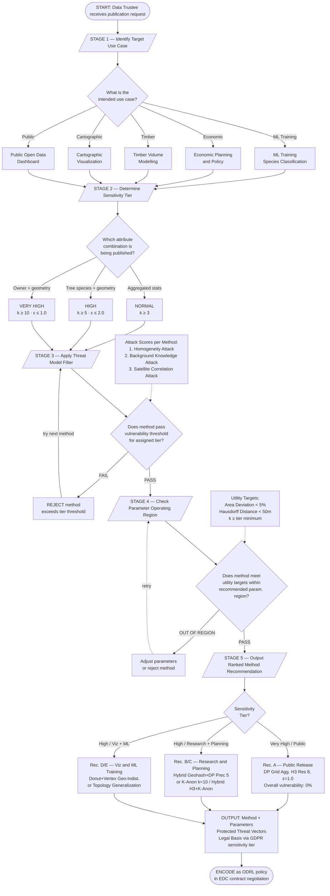

```mermaid
flowchart TD
    START([START: Data Trustee receives publication request])
    START --> S1

    S1[/STAGE 1 — Identify Target Use Case/]
    S1 --> UC{What is the<br/>intended use case?}

    UC -->|ML Training| UC1[ML Training<br/>Species Classification]
    UC -->|Economic| UC2[Economic Planning<br/>and Policy]
    UC -->|Timber| UC3[Timber Volume<br/>Modelling]
    UC -->|Cartographic| UC4[Cartographic<br/>Visualization]
    UC -->|Public| UC5[Public Open Data<br/>Dashboard]

    UC1 & UC2 & UC3 & UC4 & UC5 --> S2

    S2[/STAGE 2 — Determine Sensitivity Tier/]
    S2 --> ATTR{Which attribute<br/>combination is<br/>being published?}

    ATTR -->|Aggregated stats| NORM["NORMAL<br/>k ≥ 3"]
    ATTR -->|Tree species + geometry| HIGH["HIGH<br/>k ≥ 5 · ε ≤ 2.0"]
    ATTR -->|Owner + geometry| VHIGH["VERY HIGH<br/>k ≥ 10 · ε ≤ 1.0"]

    NORM & HIGH & VHIGH --> S3

    S3[/STAGE 3 — Apply Threat Model Filter/]

    TM["Attack Scores per Method:<br/>1. Homogeneity Attack<br/>2. Background Knowledge Attack<br/>3. Satellite Correlation Attack"]
    TM -.-> VULN

    S3 --> VULN{Does method pass<br/>vulnerability threshold<br/>for assigned tier?}

    VULN -->|FAIL| REJECT[REJECT method<br/>exceeds tier threshold]
    REJECT -->|try next method| S3

    VULN -->|PASS| S4

    S4[/STAGE 4 — Check Parameter Operating Region/]

    UT["Utility Targets:<br/>Area Deviation < 5%<br/>Hausdorff Distance < 50m<br/>k ≥ tier minimum"]
    UT -.-> PARAM

    S4 --> PARAM{Does method meet<br/>utility targets within<br/>recommended param. region?}

    PARAM -->|OUT OF REGION| ADJUST[Adjust parameters<br/>or reject method]
    ADJUST -.->|retry| S4

    PARAM -->|PASS| S5

    S5[/STAGE 5 — Output Ranked Method Recommendation/]
    S5 --> RECOUT{Sensitivity<br/>Tier?}

    RECOUT -->|Very High / Public| RECA["Rec. A — Public Release<br/>DP Grid Agg. H3 Res 8, ε=1.0<br/>Overall vulnerability: 0%"]
    RECOUT -->|High / Research + Planning| RECBC["Rec. B/C — Research and Planning<br/>Hybrid Geohash+DP Prec 5<br/>or K-Anon k=10 / Hybrid H3+K-Anon"]
    RECOUT -->|High / Viz + ML| RECDE["Rec. D/E — Viz and ML Training<br/>Donut+Vertex Geo-Indist.<br/>or Topology Generalization"]

    RECA & RECBC & RECDE --> OUTPUT

    OUTPUT["OUTPUT: Method + Parameters<br/>Protected Threat Vectors<br/>Legal Basis via GDPR sensitivity tier"]
    OUTPUT --> ODRL([ENCODE as ODRL policy<br/>in EDC contract negotiation])
```