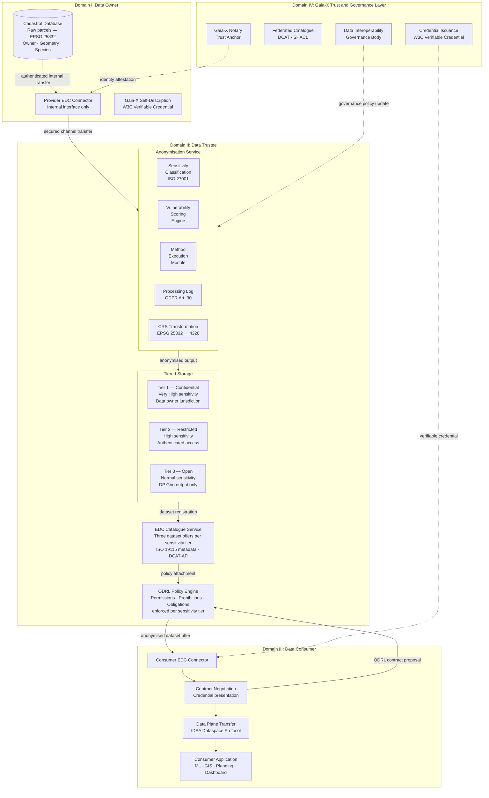

```mermaid
flowchart TB
    subgraph OWNER ["Domain I: Data Owner"]
        direction TB
        DB[("Cadastral Database<br/>Raw parcels — EPSG:25832<br/>Owner · Geometry · Species")]
        PEDC["Provider EDC Connector<br/>Internal interface only"]
        GCRED["Gaia-X Self-Description<br/>W3C Verifiable Credential"]
        DB -->|"authenticated internal transfer"| PEDC
    end

    subgraph TRUSTEE ["Domain II: Data Trustee"]
        direction TB
        subgraph ANONSERVICE ["Anonymisation Service"]
            direction LR
            MATRIX["Sensitivity<br/>Classification<br/>ISO 27001"]
            THREAT["Vulnerability<br/>Scoring<br/>Engine"]
            SANDBOX["Method<br/>Execution<br/>Module"]
            AUDIT["Processing Log<br/>GDPR Art. 30"]
            CRS["CRS Transformation<br/>EPSG:25832 → 4326"]
        end

        subgraph STORAGE ["Tiered Storage"]
            direction LR
            L1["Tier 1 — Confidential<br/>Very High sensitivity<br/>Data owner jurisdiction"]
            L2["Tier 2 — Restricted<br/>High sensitivity<br/>Authenticated access"]
            L3["Tier 3 — Open<br/>Normal sensitivity<br/>DP Grid output only"]
        end

        CATALOG["EDC Catalogue Service<br/>Three dataset offers per sensitivity tier<br/>ISO 19115 metadata · DCAT-AP"]
        ODRLENG["ODRL Policy Engine<br/>Permissions · Prohibitions · Obligations<br/>enforced per sensitivity tier"]

        ANONSERVICE -->|"anonymised output"| STORAGE
        STORAGE -->|"dataset registration"| CATALOG
        CATALOG -->|"policy attachment"| ODRLENG
    end

    subgraph CONSUMER ["Domain III: Data Consumer"]
        direction TB
        CEDC["Consumer EDC Connector"]
        NEGO["Contract Negotiation<br/>Credential presentation"]
        TRANSFER["Data Plane Transfer<br/>IDSA Dataspace Protocol"]
        APP["Consumer Application<br/>ML · GIS · Planning · Dashboard"]
        CEDC --> NEGO --> TRANSFER --> APP
    end

    subgraph IDENTITY ["Domain IV: Gaia-X Trust and Governance Layer"]
        direction LR
        NOTARY["Gaia-X Notary<br/>Trust Anchor"]
        FEDCAT["Federated Catalogue<br/>DCAT · SHACL"]
        ISSUANCE["Credential Issuance<br/>W3C Verifiable Credential"]
        DIG["Data Interoperability<br/>Governance Body"]
    end

    PEDC -->|"secured channel transfer"| ANONSERVICE
    ODRLENG -->|"anonymised dataset offer"| CEDC
    NEGO -->|"ODRL contract proposal"| ODRLENG
    NOTARY -.->|"identity attestation"| PEDC
    ISSUANCE -.->|"verifiable credential"| CEDC
    DIG -.->|"governance policy update"| ANONSERVICE
```